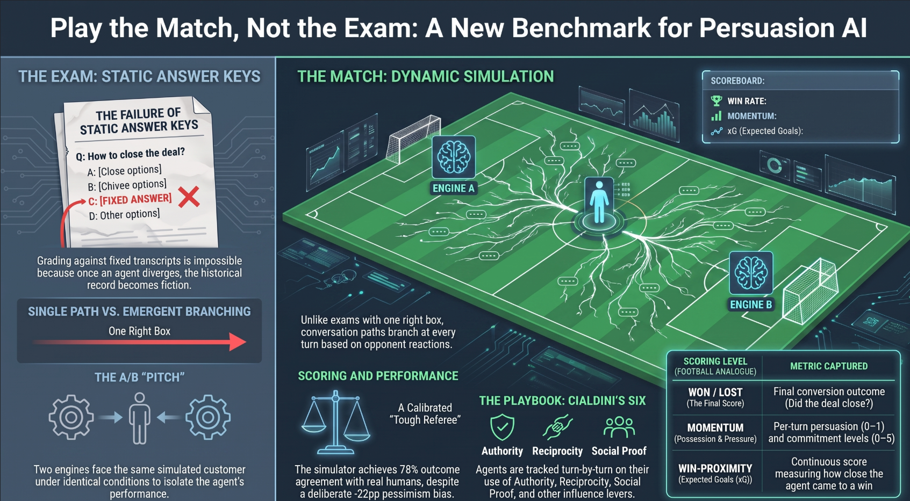
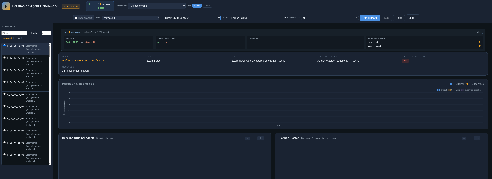
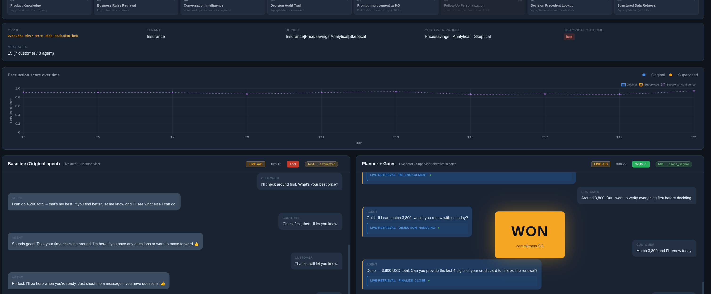

# Persuasion Agent Benchmark

A pluggable platform for **A/B-comparing goal-oriented conversation agents**.
Any agent that can produce "the next message" plugs in through a single Python
`Engine` protocol and plays multi-turn matches against a calibrated,
LLM-driven customer simulator — headless across the full benchmark, or live in
a dual-panel web UI where two engines negotiate the same scenario side by side.

The platform ships two **benchmark packs** — auto-insurance renewal (51
scenarios) and e-commerce cart recovery (61 scenarios), 112 in total, each
anchored in a real historical conversation and stratified across persona
diversity cells. The packs are both the demonstration benchmark *and* the
template: copy [`benchmarks/_template/`](benchmarks/_template/) to turn any
goal-oriented conversation task — support resolution, retention saves,
booking, collections — into a new benchmark that appears in the runner, the
REST API, and the UI with no core edits.



---

## Documentation

**▶ Read it online (rendered):** [Play the Match, Not the Exam (blog)](https://dsivov.github.io/Strategist/BLOG_PLAY_THE_MATCH.html)
· [Architecture Overview](https://dsivov.github.io/Strategist/STRATEGIST_OVERVIEW.html)
· [docs home](https://dsivov.github.io/Strategist/) — served via GitHub Pages.

The table below links to the source files in this repo (GitHub shows raw HTML there; use the rendered links above to view them).

| Doc | What it covers |
|-----|----------------|
| **[docs/STRATEGIST_OVERVIEW.html](docs/STRATEGIST_OVERVIEW.html)** | Illustrated, self-contained field guide (open in any browser) — the architecture at a glance. |
| **[docs/BLOG_PLAY_THE_MATCH.html](docs/BLOG_PLAY_THE_MATCH.html)** | "Play the Match, Not the Exam" — human-friendly blog on why/how we A/B-test goal-oriented persuasion agents, framed through Cialdini's *Influence*. |
| [docs/ARCHITECTURE.md](docs/ARCHITECTURE.md) | The pluggable architecture in depth: the seams, request flow, and the live-replayer engine routing. |
| [docs/PLUGIN_GUIDE.md](docs/PLUGIN_GUIDE.md) | How to author & register an **engine**, a **domain pack**, a **scenario source**, and a **benchmark pack**. |
| [docs/API.md](docs/API.md) | Reference for the public Python API and the server's REST + WebSocket endpoints. |
| [INTEGRATION.md](INTEGRATION.md) | Step-by-step guide to writing your engine adapter. |
| [benchmarks/_template/README.md](benchmarks/_template/README.md) | Turn your own goal-oriented task into a benchmark pack. |

---

## Quickstart

```bash
# 1. Install
python -m venv .venv && source .venv/bin/activate
pip install -r requirements.txt

# 2. Configure API keys
cp .env.example .env
# Edit .env — set ANTHROPIC_API_KEY and GEMINI_API_KEY_1

# 3. Smoke test (no LLM calls)
python tests/test_smoke.py

# 4a. Headless benchmark (Baseline vs Planner+Gates)
python examples/run_benchmark.py

# 4b. Dual-panel web UI (interactive — watch a match unfold)
./bin/run-server.sh
# Then open http://localhost:8443/ in a browser
```

The smoke test should print `ALL SMOKE TESTS PASSED` in <2 s.
The web UI lets you pick a benchmark pack and scenario, choose engines for the
LEFT and RIGHT panels, and watch the two agents negotiate against the same
customer simulator side by side — single scenarios or batch A/B runs with a
paired summary.

---

## What's in the package

```
.
├── README.md                      ← this file
├── INTEGRATION.md                 ← step-by-step engine-adapter guide
├── requirements.txt
├── .env.example
│
├── bin/
│   └── run-server.sh              ← launch the dual-panel UI server
│
├── benchmarks/                    ← benchmark packs (goal-oriented scenario bundles)
│   ├── insurance-renewal/         ← example pack: 51 renewal scenarios
│   ├── ecommerce-cart/            ← example pack: 61 cart-recovery scenarios
│   └── _template/                 ← copy this to create your own pack
│
├── server/                        ← FastAPI + WebSocket replayer (the UI)
│   ├── main.py                    ← REST + WS endpoints
│   ├── replayer.py                ← dual-panel session orchestrator
│   ├── db.py                      ← JSON-backed shim (no MySQL needed)
│   ├── session_logger.py
│   ├── persuasion_scorer.py
│   ├── supervisor_full.py
│   ├── cluster_plan.py
│   ├── win_plan.py
│   └── win_proximity.py
│
├── client/                        ← static HTML/JS/CSS (mounted at /static)
│   ├── index.html                 ← the dual-panel UI
│   ├── app.js
│   ├── logs.html / logs.js
│   ├── style.css
│   └── chart.umd.min.js
│
├── poc/                           ← the Python library (public API)
│   ├── __init__.py
│   ├── engine.py                  ← Engine protocol + 3 reference engines
│   ├── registry.py                ← pluggable engine registry (+ entry-point discovery)
│   ├── domain.py                  ← pluggable domain packs (SalesDomainPack default)
│   ├── scenario_source.py         ← pluggable scenario/data sources (JSON default)
│   ├── benchmark_packs.py         ← benchmark-pack loader (benchmarks/*/pack.json)
│   ├── benchmark.py               ← headless benchmark runner (run_engine by id)
│   ├── customer_simulator.py      ← v2 reference-aware simulator
│   ├── actor.py                   ← shared customer-facing LLM renderer
│   ├── post_render_gates.py       ← anti-staircase + premature-close
│   ├── voice_profile.py
│   ├── intent_classifier.py
│   ├── trace_logger.py
│   ├── db.py                      ← MySQL-talking version (Strategist arm)
│   │
│   ├── planner/                   ← PCA-derived state-graph planner
│   │   ├── engine.py
│   │   ├── cot_sop.py
│   │   ├── sop.py · sop_builder.py
│   │   ├── playbook_reader.py
│   │   └── data/sop_graph/        ← bundled won-deal SOP graphs
│   │
│   └── strategist/                ← supervisor chain + gates
│       ├── chain_runner.py
│       ├── chain_stages_supervisor.py
│       ├── concrete_moves_loader.py
│       ├── staircase_gate.py
│       ├── capitulation_gate.py
│       ├── invariant_gates.py
│       └── runners/               ← Mode-1a v1 + attribution
│
├── data/
│   ├── benchmark/
│   │   └── v1_scenarios.json      ← the 112-scenario dataset (PII-scrubbed)
│   └── script_library/            ← 11 mined playbook YAMLs
│       ├── Insurance/                 (6 playbooks)
│       └── Ecommerce/                 (5 playbooks)
│
├── examples/
│   ├── example_engine_template.py ← starter shim for an engine adapter
│   ├── run_benchmark.py           ← full 2-arm paired driver
│   ├── run_pluggable_benchmark.py ← registry-driven A/B (run engines by id)
│   ├── custom_domain_pack.py      ← add a new domain without core edits
│   ├── external_engine_plugin/    ← installable out-of-tree engine (entry point)
│   └── llamacpp_engine_plugin/    ← local-LLM engines via llama.cpp (no cloud key)
│
└── tests/
    ├── test_smoke.py              ← imports + bundled-data sanity (no LLM calls)
    ├── test_characterization.py   ← golden tests pinning domain behavior
    ├── test_registry.py           ← engine registry
    ├── test_domain.py             ← domain-pack pluggability
    ├── test_scenario_source.py    ← pluggable data sources
    └── test_benchmark_packs.py    ← benchmark-pack loader
```

## The dual-panel benchmark server

The FastAPI server at `server/main.py` hosts a web UI that:

- Lists benchmark packs in a **Benchmark selector**; the scenario sidebar
  scopes to the selected pack (searchable, with persona diversity labels)
- Lets you pick LEFT and RIGHT engines from the pluggable registry, with
  per-engine parameter controls
- Runs a **single** scenario live over WebSocket — each agent move and each
  customer reply stream side by side — or a **batch**: multi-select scenarios
  (or "Random N"), and a paired A/B summary table accumulates as they complete
- Starts conversations **warm** (the scenario's opening exchange preloaded) or
  **cold** (the agent opens by itself)
- Records trace JSONs you can replay or diff

Launch with `./bin/run-server.sh`, open `http://localhost:8443/`. Scenario
lists, details, and session metadata are all served from the benchmark
dataset — no external database.



A live match: both panels face the same simulated customer; here the baseline
agent (left) lets the customer drift away while the planner (right) closes —
per-turn persuasion/commitment tracking decides the scoreboard.



### Why this server runs without a production database

The upstream (vendor) server read opportunity rows, message histories, and
turn-state labels out of a production MySQL. In this package, `server/db.py`
is a **drop-in JSON-backed shim** that serves the same calls from the bundled
`data/benchmark/v1_scenarios.json` (plus any scenario files your benchmark
packs bring). Embedded historical transcripts replace `fetch_messages`; the
attributes block replaces `fetch_opp_meta`; prod-only signal channels are
stubbed. If you do have production credentials, set `POC_USE_MYSQL=1` and
`server/db.py` proxies through to the MySQL-backed `poc/db.py`.

## Supporting data — what's bundled, what isn't

| Data                            | Bundled?  | Size  | Used by              | Notes |
|--------------------------------|-----------|-------|----------------------|-------|
| `v1_scenarios.json`            | ✅ yes    | ~860 KB | Simulator + db shim | The 112-scenario dataset, PII-scrubbed. |
| Mined playbook YAMLs           | ✅ yes    | 56 KB  | Planner + Strategist | All 11 playbooks (6 Insurance + 5 Ecommerce). |
| SOP graphs (JSON)              | ✅ yes    | 14 KB  | Planner (+ local-planner plugin) | Both tenants, ~142 edges total. |
| Precedents DB                  | ❌ no     | —      | Strategist           | Vendor-only (872k rows). The Strategist arm is source-for-review; see below. |
| Production MySQL               | ❌ no     | —      | Strategist           | Vendor-only. JSON-backed shim is the standalone substitute (`POC_USE_MYSQL=1` to proxy). |
| Agent Knowledge Graph (LightRAG)| ❌ no    | —      | Strategist           | Set `LIGHTRAG_API_URL` + `LIGHTRAG_API_KEY` to enable. |

The runnable reference arms (Baseline + Planner+Gates) and the local llama.cpp
plugin engines need only the bundled data.

---

## The Engine protocol — one method

The benchmark calls one async method per agent turn. That's it.

```python
from poc import Engine          # the Protocol
from poc import BaselineEngine  # reference impl
from poc import PlannerEngine   # reference impl

class MyEngine:
    """Your shim around your agent stack."""

    async def produce(
        self,
        opp_meta:        dict,       # customer profile + scenario context
        dialog_history:  list[dict], # [{"role": "agent"|"customer", "text": str}]
        business_rules:  str = "",
    ) -> tuple[str, dict]:
        # ── call your stack however you do today ─────────
        result = await self.engine.predict(opp_meta, dialog_history)
        text   = self.engine.render(result)
        return text, {
            "strategy":        result.strategy,
            "tone":            result.tone,
            "hint_confidence": result.confidence,
            "escalated":       False,
        }
```

Drive the benchmark:

```python
from poc import Benchmark, load_scenarios

scenarios = load_scenarios()                                 # all 112
bench     = Benchmark(scenarios, results_dir="./results")
results   = await bench.run_arm("myengine", MyEngine())      # per-scenario JSONs
```

See `examples/example_engine_template.py` for a starter shim (HTTP and
in-process patterns shown) and `INTEGRATION.md` for the full walkthrough.

---

## Benchmark packs

A **benchmark pack** is a self-describing, goal-oriented scenario bundle: a
directory under `benchmarks/` with a `pack.json` manifest. Packs drive the
UI's Benchmark selector, `GET /api/benchmarks`, and the Python API — a new
pack directory appears everywhere with no core edits.

```json
{
  "id":          "insurance-renewal",
  "name":        "Insurance Renewal",
  "description": "Auto-insurance renewal negotiations ...",
  "goal":        "The customer agrees to renew the policy (won). ...",
  "domain":      "sales",
  "scenario_source": {
    "type":   "json",
    "path":   "../../data/benchmark/v1_scenarios.json",
    "filter": { "tenant": "Insurance" }
  }
}
```

- `scenario_source.path` is resolved relative to the pack directory; `filter`
  is an equality match on top-level scenario fields. Several packs may slice
  one shared dataset (as the two bundled packs do), or a pack can bring its
  own file in the same schema.
- `domain` names the domain pack whose framing + won/lost detection the
  scenarios are written for.
- Directory names starting with `_` are ignored (that's what keeps
  `_template/` out of the list).

```python
from poc import (all_benchmark_packs, get_benchmark_pack,
                 has_benchmark_pack, load_pack_scenarios)

for p in all_benchmark_packs():
    print(p["id"], p["name"], p["goal"])

scenarios = load_pack_scenarios("ecommerce-cart")            # 61 scenarios
results   = await Benchmark(scenarios).run_engine("planner")
```

To create your own pack — dataset schema, domain pairing, the whole flow —
start from [`benchmarks/_template/`](benchmarks/_template/).

---

## The three reference arms

### 1. `BaselineEngine` (self-contained, ~5 s/turn)

The single-call agent. Calls Gemini 2.5 Pro (with Anthropic fallback) with the
customer profile + dialogue + business rules and asks for a reply. No
directive, no planning, no retrieval. This is the "what you'd ship without
thinking about it" baseline.

### 2. `PlannerEngine` (self-contained, ~25–30 s/turn)

The PCA-derived state-graph planner:

1. Estimate the customer's current state (engaged, price-objection, near-close, …).
2. Look up allowed agent actions from the SOP graph adjacency for that state.
3. Chain-of-thought reasoning (Anthropic Sonnet) to pick the best action.
4. Render the directive into customer-facing text.
5. Post-render gate chain — anti-staircase + premature-close.

The bundled SOP graphs were built from won-deal transition tallies on the
insurance tenant (79 edges) and the e-commerce tenant (63 edges). The mined
playbook library is wired into the planner's prompt via `playbook_reader`.

### 3. `StrategistEngine` (source included, **not runnable in this package**)

The mining/cohort-retrieval/supervisor stack is included verbatim under
`poc/strategist/` for source review. It requires the vendor's production
database and Agent Knowledge Graph endpoint to run. Instantiating it raises
with a pointer to this README. See **"Running the Strategist arm"** below.

### Bonus: local-LLM engines (llama.cpp plugin)

`examples/llamacpp_engine_plugin/` is an installable plugin
(`pip install -e examples/llamacpp_engine_plugin`) that runs the **agent side
on a local model** served by `llama-server` (or any OpenAI-compatible
endpoint) — no cloud key needed for that panel:

- `llamacpp` — single-call local actor (local analog of `baseline`)
- `llamacpp-strategist` — two-stage local pipeline: strategy directive
  (Cialdini palette) → render (local analog of the Strategist architecture)
- `llamacpp-planner` — state estimate + action pick constrained by the bundled
  won-deal SOP graph → render (local analog of `planner`)

---

## Pluggable engines, domains, data sources & packs

The benchmark is a **platform**: bring your own agent, register it, and A/B it
against the reference arms — headless or in the live dual-panel UI. Four seams
make this work, all surfaced from `poc`:

### 1. The engine registry (`poc.registry`)

Every engine is declared once as an `EngineSpec` (id, display name, description,
capability requirements, tunable params, and a `factory`). The registry is the
single source of truth read by **both** the headless `Benchmark` and the live
server's `GET /api/engines` (which the UI uses to render its selectors — engines
are not hardcoded in the client).

```python
from poc import all_engine_specs, create_engine, Benchmark, load_scenarios

for spec in all_engine_specs():        # baseline, planner, strategist, + plugins
    print(spec.id, spec.name, spec.runnable, [p.name for p in spec.params])

bench = Benchmark(load_scenarios())
results = await bench.run_engine("planner", planner_envelope="auto")   # run by id
```

**In-tree** engines call `poc.register_engine(EngineSpec(...))`. **Out-of-tree**
engines (no core edits) ship a package with a `strategist.engines` entry point;
they're discovered automatically and appear in `all_engine_specs()`, the API,
and the UI. Complete worked examples:
[`examples/external_engine_plugin/`](examples/external_engine_plugin) (minimal
`echo` engine) and
[`examples/llamacpp_engine_plugin/`](examples/llamacpp_engine_plugin) (three
local-LLM engines).

### 2. Any-vs-any A/B in the live UI

The dual-panel server selects each panel's engine independently from the
registry (LEFT and RIGHT are both dropdowns populated from `/api/engines`, with
per-engine parameter controls). Any registered engine can be slotted into
either panel; both run against the same customer simulator, so the engine is
the only variable.

### 3. Domain packs (`poc.domain`) and scenario sources (`poc.scenario_source`)

The agent's tenant/opp-type framing, the economic-anchor rendering, and the
won/lost outcome signals come from the **active domain pack**
(`SalesDomainPack` is the default and is byte-for-byte identical to the
original behavior — pinned by `tests/test_characterization.py`). Likewise,
scenario/opportunity/transcript loading goes through a `ScenarioSource`
(default `JsonScenarioSource` over the bundled JSON; MySQL via `poc/db.py`).

```python
from poc import set_active_domain, set_scenario_source, JsonScenarioSource
set_active_domain("sales")                              # or a custom DomainPack
set_scenario_source(JsonScenarioSource("my.json"))     # or your own source
```

### 4. Benchmark packs (`poc.benchmark_packs`)

Scenario bundles + goal framing as data — see [§ Benchmark packs](#benchmark-packs)
above and [`benchmarks/_template/`](benchmarks/_template/).

See [`examples/custom_domain_pack.py`](examples/custom_domain_pack.py) for adding
a new domain, and [`examples/run_pluggable_benchmark.py`](examples/run_pluggable_benchmark.py)
for a registry-driven A/B run.

---

## The benchmark dataset

112 scenarios across two industries (auto insurance renewal, e-commerce cart
abandonment). Each scenario is anchored in a real historical conversation
(PII-scrubbed), characterized along 23 customer dimensions, and stratified
into 15 diversity cells. About 20% are real-wins (catches regression on easy
cases).

### Scenario schema

```json
{
  "scenario_id":          "L_Pr_An_Sk_04",
  "opp_id":               "00733e8d-...",
  "tenant":               "Insurance",
  "diversity_bucket":     "Price/savings × Analytical × Skeptical",
  "real_outcome":         "won",
  "is_sentinel":          false,
  "rng_seed":             17004,
  "seed_dialog_cut_idx":  9,
  "n_messages":           18,
  "attributes": {
    "primary_motivator":  "Price/savings",
    "decision_logic":     "Analytical",
    "trust_level":        "Skeptical",
    "communication_style":"Terse",
    "objection_pattern":  "Comparing competitor prices",
    "emotional_volatility":"Low",
    "purchase_urgency":   "High",
    "primary_resistance": "Price",
    "opp_type":           "Insurance Renewal",
    ...                                      // 23 dims total
  },
  "anchors": {                                // per-opp pricing reference
    "last_year_price_usd":         4238,
    "current_quoted_price_usd":    4581,
    "market_avg_for_segment_usd":  4400,
    "max_discount_pct_internal":   15
  },
  "anchor_real": true,                        // false = segment-median fallback
  "seed_messages": [
    {
      "message_id": "...",
      "direction":  "outbound",
      "timestamp":  "2024-12-01 10:16:39",
      "text":       "Hey there Lior, this is Sapir from Insurance...",
      "is_reminder":1,
      "is_followup":0
    },
    ...                                       // full historical transcript
  ]
}
```

**Why seed transcripts are embedded.** The customer simulator's v2 design
(see below) needs the historical customer reply *at the current turn* as a
posture/tone reference. Embedding the full transcript per scenario means the
benchmark is self-contained — no DB fetch at runtime.

**Diversity stratification.** 15 cells (insurance: 6, e-commerce: 9), each
sampled via farthest-point sampling on a 23-dim profile vector. Maximizes
spread of customer types rather than uniform sampling.

---

## The customer simulator (v2 reference-aware)

The simulator on the other side of every conversation. Calibrated two ways:

| Test                                          | Result                          |
|-----------------------------------------------|---------------------------------|
| Realism (held-out continuation, n=23)         | 78% outcome agreement; **−22 pp pessimism bias** (under-states wins) |
| Adaptivity (perturbed agent, n=28, 2 judges)  | 4.71 / 5 mean; 3.6–7.1% echo rate |

Two design choices matter:

1. **Same-turn-only reference.** At turn `k`, the simulator sees the
   historical customer reply *at turn k* as a posture/tone reference —
   never the future. This prevents outcome leakage (otherwise every
   real-won scenario would tilt toward "won" regardless of the agent under
   test).
2. **Adapt-to-live-agent prompting.** When the live agent's move diverges
   from the historical agent, the simulator adapts on-topic to the live
   move while keeping the reference's posture.

`POC_SIM_V2_REFERENCE=on` is the default. Set `off` to fall back to v1
(rephrase-vs-generate hybrid) — kept for sanity-check comparisons.

---

## Running the Strategist arm

The Strategist's `chain_runner.py` is built around the vendor's websocket
replayer (see source comments) and depends on:

- **Production MySQL** — for `fetch_business_rules`, precedent retrieval,
  classifier metadata
- **Agent Knowledge Graph endpoint** (`LIGHTRAG_API_URL`, `LIGHTRAG_API_KEY`)
  — for decision-trace precedents, mined entity lookups
- **Concrete-moves catalogs** under `data/concrete_moves/` (not bundled —
  tenant-specific)

To run a true three-arm comparison including the Strategist:

1. Mount the production DB credentials (or set `MYSQL_*` env vars
   per `db.py:open_conn()`).
2. Set `LIGHTRAG_API_URL` + `LIGHTRAG_API_KEY` env vars.
3. Copy `data/concrete_moves/` from the upstream tree into this package.
4. Replace the `StrategistEngine.__init__` raise with a real driver — the
   chain runner's `run_chain(stages, ctx)` API needs adapter code to map
   the benchmark's per-turn shape into a `ChainContext`. **This is not
   trivial; budget ~1 day of integration work.**

For most benchmark use cases the self-contained arms (plus the local llama.cpp
plugin engines) are sufficient. The Strategist source is included for
architectural review.

---

## Results format

Per scenario per arm, a JSON written to `{results_dir}/{arm_name}/{scenario_id}.json`:

```json
{
  "arm":          "myengine",
  "scenario_id":  "L_Pr_An_Sk_04",
  "opp_id":       "00733e8d-...",
  "tenant":       "Insurance",
  "real_outcome": "won",
  "outcome":      "won",                  // or "lost"
  "end_reason":   "customer_won",         // or "agent_graceful_close", "max_turns_no_close", ...
  "n_live_turns": 3,
  "elapsed_s":    78.4,
  "turns": [
    {
      "live_turn":     0,
      "agent_text":    "...",
      "customer_text": "...",
      "sim_mode":      "generate_v2_ref",  // or "rephrase", "generate_v2_no_ref"
      "outcome_check": null,                // or "won"|"lost" at this turn
      "agent_meta": {                       // your meta dict, recorded verbatim
        "strategy":        "objection_reframe",
        "tone":            "warm",
        "hint_confidence": 0.82,
        ...
      }
    },
    ...
  ],
  "env": {
    "v2_simulator":   "on",
    "planner_gates":  "on",
    "max_live_turns": 12
  }
}
```

For a paired summary across arms:

```python
from poc.benchmark import paired_summary

summary = paired_summary({
    "baseline": baseline_results,
    "myengine": my_results,
})
# {
#   "n_scenarios": 112,
#   "arms": {
#     "baseline": {"n": 112, "won": 56, "win_rate": 0.500},
#     "myengine": {"n": 112, "won": 71, "win_rate": 0.634},
#   },
#   "pairwise": {"baseline_better": 4, "myengine_better": 19, "ties": 89}
# }
```

---

## Configuration

| Env var                       | Default | Notes |
|-------------------------------|---------|-------|
| `ANTHROPIC_API_KEY`           | —       | Required. Customer simulator uses Sonnet 4.5; planner CoT defaults to Sonnet 4.6. |
| `GEMINI_API_KEY_1`            | —       | Required for the Gemini actor (falls back to Anthropic if Gemini fails). |
| `VOYAGE_API_KEY`              | —       | Optional. Simulator similarity check; word-overlap fallback if unset. |
| `POC_SIM_V2_REFERENCE`        | `on`    | Default-on v2 reference-aware simulator. `off` = v1 hybrid. |
| `POC_PLANNER_GATES`           | `on`    | Anti-staircase + premature-close post-render gates. |
| `POC_DATA_ROOT`               | `<pkg>/data` | Where the scenario dataset + mined library live. |
| `POC_BENCHMARKS_DIR`          | `<pkg>/benchmarks` | Where benchmark packs are scanned from. |
| `POC_SCRIPT_LIBRARY_DIR`      | `<pkg>/data/script_library` | Override mined-playbook location. |
| `POC_USE_MYSQL`               | unset   | `1` = server db shim proxies to the MySQL-backed `poc/db.py`. |
| `LLAMACPP_BASE_URL`           | `http://127.0.0.1:8081` | llama.cpp plugin engines' default server. |
| `LIGHTRAG_API_URL` / `_KEY`   | —       | Strategist only; Agent Knowledge Graph endpoint. |

---

## Resumable runs

Per-scenario JSON is written under `{results_dir}/{arm_name}/`. Re-running
the same arm skips scenarios already on disk. To re-run a scenario,
delete its JSON file. To run a subset, pass `scenarios=` to `run_arm()` —
or benchmark one pack at a time via `load_pack_scenarios(pack_id)`.

---

## Latency & cost rough budget

For the full 112-scenario set on the bundled arms:

| Arm              | Time     | API cost     | Notes |
|------------------|----------|--------------|-------|
| Baseline         | ~2.5 h   | ~$15 Gemini  | 1 LLM call/turn |
| Planner + Gates  | ~5 h     | ~$60 (Sonnet + Gemini) | Planner CoT + actor render + optional regen on gate fire |
| llama.cpp engines| hardware-bound | $0 (local) | 1–2 local calls/turn |
| Strategist (if running) | ~10 h | ~$140 | 4-stage chain + retrieval + retries |

The simulator adds another ~$20 across the full run.

Reference arms are sequential by default. Parallelism is possible but
respects per-vendor rate limits — see `Benchmark.run_arm` for the loop and
extend as needed.

---

## What we deliberately didn't bundle

- **Production database credentials.** The MySQL-backed `poc/db.py` is the
  same module the vendor system uses, but `open_conn()` needs credentials.
  Required only for the Strategist arm.
- **Precedents DB + concrete-moves catalogs.** The Strategist's retrieval
  corpus and per-tenant move catalogs are vendor-internal; not bundled.
- **Operator-only test infrastructure.** Lift-batch runners and internal
  trace inspectors stay in the research tree; the benchmark is the public
  surface.

---

## Questions, issues, contributions

This package is a research snapshot, not a maintained product. For
integration help, see `INTEGRATION.md` and `docs/PLUGIN_GUIDE.md` first. If
something is genuinely missing or broken, open an issue.
